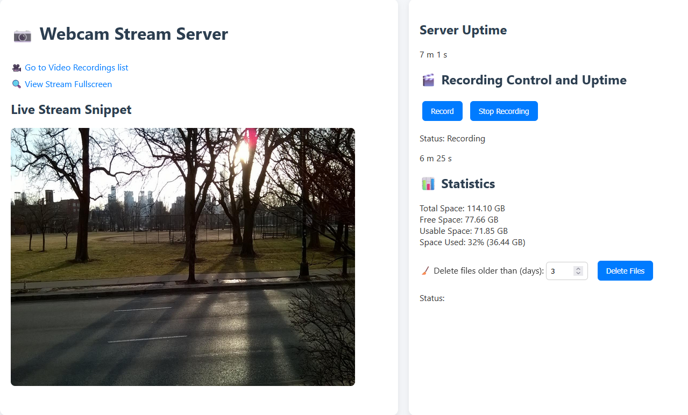

# JServer Webcam Relay and Recording

This project provides components for streaming and recording a webcam feed, primarily developed on a Raspberry Pi. It utilizes a lightweight C server for initial capture and streaming, and a Java server for multi-client relaying, web control, and recording via FFmpeg.



## Architecture

The system is designed with the following components:

1.  **Camera Device:** The physical webcam, typically exposed as a V4L2 device like `/dev/video0`.

2.  **FFmpeg Mirror Process (Current Setup):** In the current setup, an FFmpeg process reads from the primary camera device (`/dev/video0`) and creates virtual video devices (`/dev/video98`, `/dev/video99`) using `v4l2loopback`. This allows multiple applications to access the camera feed simultaneously.

3.  **C Server:** A lightweight HTTP server component written in C. It reads the video feed from a specific V4L2 mirrored device (currently `/dev/video99`) and serves it as a single-client MJPEG stream over HTTP on port 8080.

4.  **Java Server (Future Component):** This server, built with Java, is the central control and relay application.
    * It connects to the MJPEG stream provided by the C server (`http://localhost:8080`).
    * It relays this stream to multiple connected web clients via its own HTTP endpoint (`/stream` on port 9090).
    * It serves a simple HTML homepage (`/`) containing a Live-feed snipptet and statistics about the disk space, and a page listing recorded videos (`/videos`).
    * It provides a web endpoint (`/record`) to start and stop video recording.
    * For recording, it **invokes a separate FFmpeg process** directly. This FFmpeg process reads the video feed from a V4L2 device (currently planned to read from `/dev/video98`) and saves 30-minute segments as MKV files using hardware acceleration (`h264_v4l2m2m`).
    * It provides endpoints (`/videos`, `/clips/`) to list and download the recorded MKV clips from the `./clips` directory.
    
## Compiling the C Server

The C server source code is located in the `src/main/c` directory. You can compile it using a standard C compiler like GCC on your Linux system.

1.  Navigate to the root directory of this repository in your terminal.
2.  Compile the C file(s). You will need V4L2 development headers installed (`libv4l2-dev` package on Debian/Ubuntu) and need to link against the V4L2 library.

    ```bash
    gcc src/main/c/*.c -o c_server -std=c99 -pedantic -Wall -Wextra -O2 -lv4l2
    ```
3. To start the server run

   ```
   nohup ./c_server &
   ```
   This will run the C server in the background allowing us to close the terminal.

## Compiling the Java Server

1. We can compile the Java project by running

``
mvn clean install
mvn clean package
``

2. We can run

```
nohup java -jar target/JServer-1.0-SNAPSHOT-jar-with-dependencies.jar
```

This will make a .jar file containing all the depencencies (including `index.html` and `style.css`) inside the target folder

## Setup

To setup you run

```sh start_stream_mirror.sh```

This starts the ffmpeg process to mirror /dev/video0, then i start the C server followed by the Java server.

## License

This project is licensed under the MIT License. See the `LICENSE` file for details.
